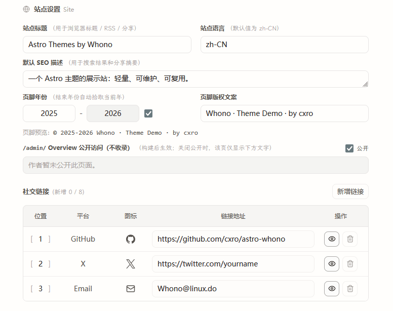
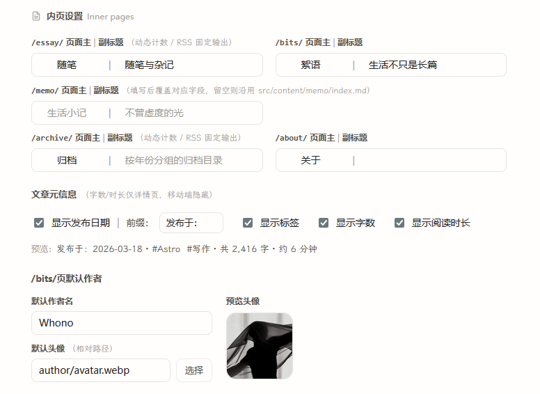

astro-whono provides a local Theme Console for centrally managing theme-level configuration in a development environment.

The Theme Console lives at `/admin/theme/`. It mainly covers site info, the sidebar, the homepage, inner-page copy, and a few reading and code-display options, so you can quickly adjust site theme settings after forking or cloning.

:::note[Development environment]
`/admin/theme/` is only available in the development environment. In production it shows only a local-development notice and provides no editing.
:::

## Local startup and entry

When developing locally, start the project with:

```bash
npm install
npm run dev
```

By default the dev server runs at `http://localhost:4321/`. After it starts, open:

```text
http://localhost:4321/admin/theme/
```

If you changed the dev port, replace `4321` with your actual port.

`/admin/` is the backend Site Overview entry, used to view a site snapshot. The Theme Console lives at `/admin/theme/` — note the difference between these two entries.

## Development and production environments

The Theme Console is a configuration tool for local maintainers. Its behavior across environments:

- Development environment: `/admin/theme/` can read and save theme configuration
- Production environment: `/admin/theme/` keeps only a local-development notice and shows no editable forms
- `/api/admin/settings/`: available only in the development environment; not a public API

## Scope

The Theme Console currently handles the following kinds of configuration:

- Site title, default language, and default SEO description
- Footer year and copyright copy
- Whether the `/admin/` overview is shown to visitors, and the copy shown when off
- Social links and their order
- Sidebar site name, quote copy, navigation order, and visibility
- Sidebar action icons (reading mode / RSS / theme switch / site overview entry)
- Homepage hero, home intro, and the home intro's inner entries
- Titles and subtitles for `/essay/`, `/archive/`, `/bits/`, `/memo/`, and `/about/`
- Article meta display options
- Code block line numbers

## Configuration files

Saved settings are written, grouped, into `src/data/settings/`:

```text
src/data/settings/
  site.json
  shell.json
  home.json
  page.json
  ui.json
```

> If `src/data/settings/*.json` does not exist yet, it is generated automatically the first time you save in `/admin/theme/`.

The Theme Console manages the theme configuration inside the repository, so changes can still be tracked and rolled back through Git.

Theme configuration is read in a fixed order: `src/data/settings/*.json` first, then legacy configuration, then project defaults. The "legacy configuration" here mainly comes from `site.config.mjs` and default constants inside components.<br>
In other words, right after cloning you can use the default configuration; once you save in the Theme Console once, a trackable settings JSON is generated.

## Page grouping

`/admin/theme/` is currently split into five groups by editing scene.

### Site

`Site` handles site-level basics:

- Site title
- Default language
- Default SEO description
- Footer year and copyright copy
- Whether the `/admin/` overview is shown externally, and the copy shown when off
- Social links

> 

### Sidebar

`Sidebar` handles shell and navigation configuration:

- Sidebar site name
- Sidebar quote copy
- Sidebar divider style
- Show/hide sidebar action icons (reading mode / RSS / theme switch / site overview)
- Navigation name, order, suffix characters, and visibility

> 

### Home

`Home` handles homepage display configuration:

- Hero image URL and description
- Hero reveal
- Home intro lead copy
- Home intro supplementary copy
- The primary and secondary links in the intro

> 

The home intro supplementary copy uses a fixed sentence pattern; the backend only exposes copy and entry selection, to keep the homepage structure as stable as possible. The currently selectable entries are `archive`, `essay`, `bits`, `memo`, `about`, and `tag`.

### Inner Pages

`Inner Pages` handles unified copy and display strategy at the inner-page level:

- `/essay/` page title and subtitle
- `/archive/` page title and subtitle
- `/bits/` page title and subtitle
- `/memo/` page title and subtitle
- `/about/` page title and subtitle
- Whether article meta shows date, tags, word count, and reading time
- `/bits/` default author name and avatar

> 

### Code

- Whether to show line numbers in code blocks

## Save mechanism

- The save button writes back to the `site / shell / home / page / ui` groups; it does not modify template source code directly
- Most fields offer instant preview or a clear page correspondence
- Fields are validated before saving
- Version info is attached on save, to avoid silent overwrites from concurrent edits
- The write process rolls back on failure, avoiding a half-written multi-file state

---

The above covers the Theme Console's commonly used configuration entries and save mechanism. If you run into configuration anomalies or save issues, please open an Issue.
